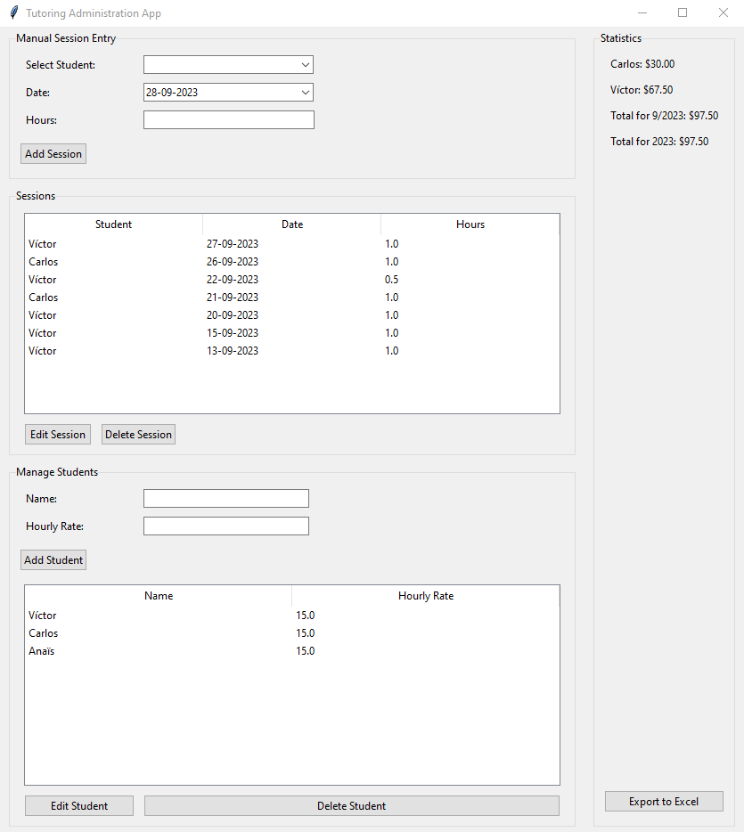

# 🎓 **Tutoring Administration App** 🎓

Easily manage your tutoring sessions with this intuitive, GUI-based application built with Python's `tkinter`.

## ✨ **Features** 
- 📚 **Student Management**: Add, edit, or delete student details with ease.
- ⏳ **Session Mastery**: Log tutoring sessions manually and keep them organized.
- 💰 **Earnings Insights**: Track your earnings per student and get monthly and yearly summaries.
- 📊 **Excel Exports**: Need a report? Export your data to an Excel file in seconds!

## 🚀 **Getting Started**

### **Prerequisites**
Ensure you have the following installed:
- Python 3.x
- SQLite3

### **Dependencies**
Install the necessary Python packages:
'''
pip install pandas openpyxl tkcalendar
'''

### **Initialization**
First things first, set up your database:
'''
python databaseInitializer.py
'''

### **Launch the App**
Now, you're all set! Launch the app and get started:
'''
python app.py
'''

## 📘 **How to Use**

1. **Manage Students**: Set up your students and their hourly rates.
2. **Log Sessions**: Add details for each tutoring session.
3. **View & Edit**: Browse sessions, make edits, or remove them.
4. **Track Earnings**: Always know what you've earned.
5. **Export Data**: Create Excel reports anytime you need.

## 📜 **License**
This project is licensed under the MIT License.
